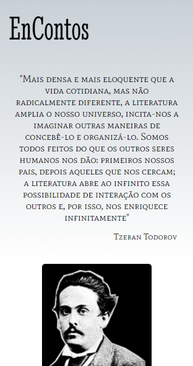
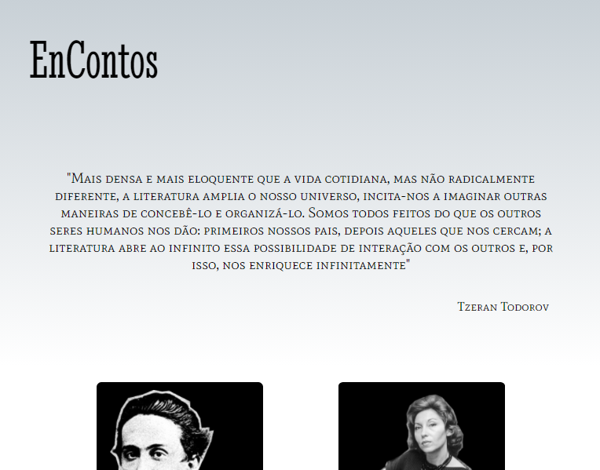
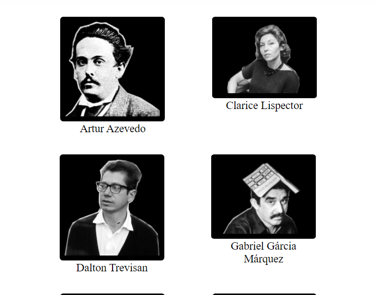
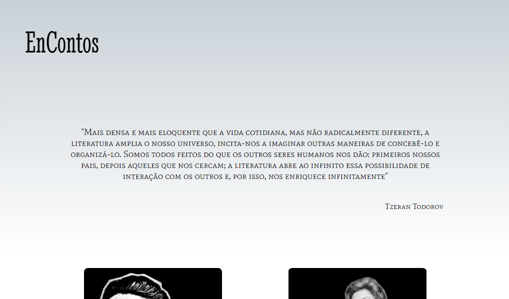
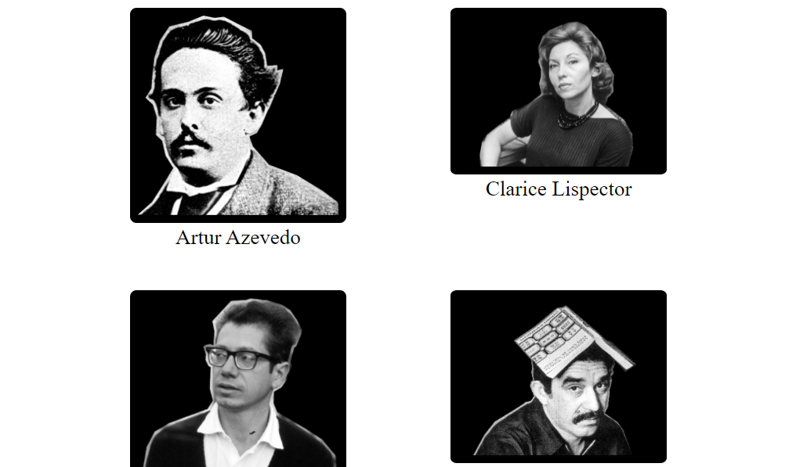
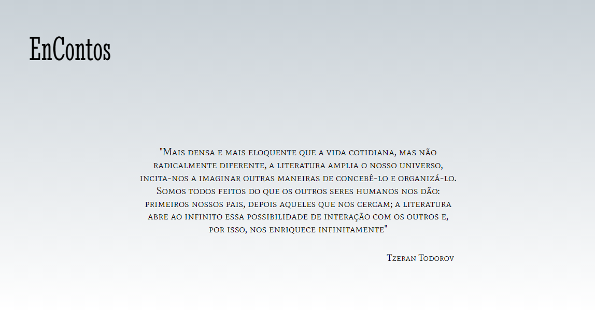
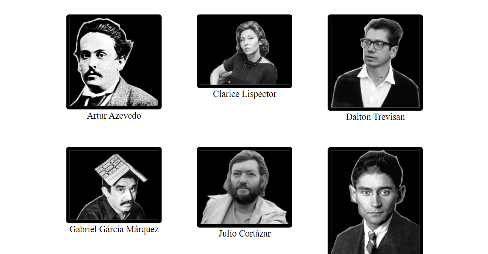

# EnContos
> Site baseado no Projeto de extensão EnContos, do IFPR - Cascavel; contendo os autores lidos no decorrer dos anos de 2018-2020.

Este projeto consiste em primeiro momento em um estudo prático inicial acerca de web design responsivo com utilização de medias queries e medidas relativas com a definição de breakpoints para aplicação de diferentes estilos nas imagens de acordo com a largura dos dispositivos - `devide-width`; e nas fontes com medidas variantes conforme o elemento-pai (`em`) e raiz (`rem`).  
    
Ademais, para gerenciar o tamanho adequado das imagens em relação ao *viewport* foi empregado o *display* flex e unidade vw.

### Screenshots

#### Largura de 320 pixels

#### Largura de 768 pixels

#### Largura de 1023 pixels

#### Largura de 1440 pixels

